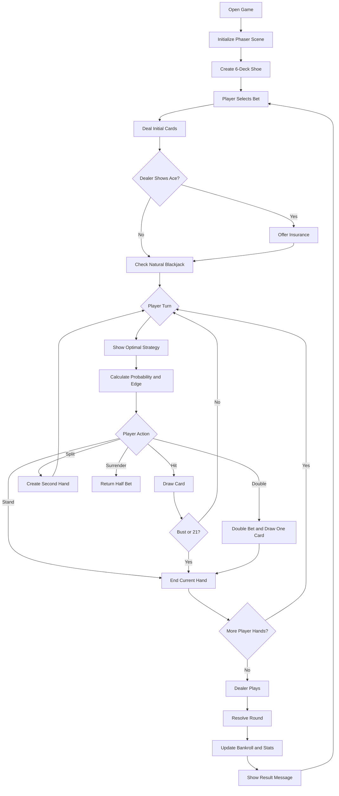
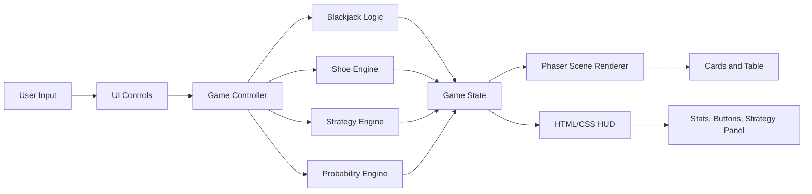

# The 21st Jack — Real-time Probabilistic Strategy Engine For Blackjack

**The 21st Jack** is a modern web-based Blackjack simulation game built for learning, strategy testing, and casino-style gameplay. It combines a playable Blackjack table with a real-time probability/strategy engine, Hi-Lo card counting, true count tracking, and responsive UI for desktop, tablet, and mobile browsers.

> Educational simulation only. This project does not involve real-money gambling.

---

## Live / Repository


---

## Preview

The game presents a polished Blackjack table with:

- Dealer and player hands
- Responsive betting/action controls
- Real-time bankroll
- Shoe penetration meter
- Running count and true count
- Player edge estimate
- Strategy recommendation panel
- Session statistics
- Sarcastic loss feedback messages

---

## Key Features

### Gameplay

- Standard Blackjack gameplay
- Hit, stand, double, split, surrender
- Insurance decision when dealer shows Ace
- Multiple player hands after split
- Dealer automated play
- Round resolution with win/loss/push messages

### Rule Set

- 6-deck shoe
- H17: dealer hits soft 17
- DAS: double after split
- Late surrender
- Blackjack pays 3:2
- Insurance pays 2:1
- Shoe reshuffle based on penetration

### Strategy Engine

- Basic strategy helper
- Hard hand strategy
- Soft hand strategy
- Pair-splitting strategy
- Late surrender logic
- Count-based strategy deviations
- Real-time optimal action display

### Probability / Counting

- Hi-Lo running count
- True count calculation
- Remaining shoe cards
- Player edge estimate
- Kelly-style betting suggestion
- Real-time win probability estimate

### UI / UX

- Modern casino-style design
- Desktop and mobile responsive layout
- Touch-friendly controls
- Sticky mobile controls
- Animated cards
- Session history dots
- Loss roast messages for personality

---

## Tech Stack

| Area | Technology |
|---|---|
| Language | TypeScript |
| Build Tool | Vite |
| Game Engine | Phaser 3 |
| UI | HTML + CSS overlay |
| Testing | Vitest |
| Package Manager | npm |
| Target Platform | Web browser |
| Editor | VS Code |

---

## Why This Stack?

This project uses **Phaser + TypeScript + Vite** because it is lightweight, fast, and ideal for a 2D browser card game. Phaser handles the game table, cards, scene rendering, and animations, while HTML/CSS handles HUD panels, buttons, statistics, and mobile-friendly controls.

This hybrid approach is better than keeping everything in one HTML file because it gives the project:

- Cleaner code organization
- Easier debugging
- Stronger type safety
- Faster development workflow
- Easier deployment
- Better mobile support
- Better future scalability

---

## Project Structure

```text
The-21st-Jack/
├── public/
│   └── assets/
│       ├── audio/
│       ├── cards/
│       └── ui/
├── src/
│   ├── game/
│   │   ├── BlackjackScene.ts
│   │   ├── GameController.ts
│   │   └── constants.ts
│   ├── logic/
│   │   ├── blackjack.ts
│   │   ├── shoe.ts
│   │   ├── strategy.ts
│   │   ├── probability.ts
│   │   └── session.ts
│   ├── ui/
│   │   ├── hud.ts
│   │   ├── controls.ts
│   │   └── messages.ts
│   ├── styles/
│   │   └── main.css
│   ├── main.ts
│   └── vite-env.d.ts
├── tests/
│   ├── blackjack.test.ts
│   └── strategy.test.ts
├── index.html
├── package.json
├── tsconfig.json
├── vite.config.ts
└── README.md
```

---

## Installation

### 1. Clone the Repository

```bash
git clone https://github.com/Parthpee/The-21st-Jack.git
cd The-21st-Jack
```

### 2. Install Dependencies

```bash
npm install
```

### 3. Start Development Server

```bash
npm run dev
```

Then open:

```text
http://localhost:5173
```

---

## macOS Catalina Note

For older Macs running **macOS Catalina**, use **Node.js 18 LTS**. Newer Vite versions may require Node 20+, so this project should use Catalina-compatible dependency versions.

Recommended check:

```bash
node -v
npm -v
```

Expected Node version for Catalina setup:

```text
v18.x.x
```

---

## Available Scripts

```bash
npm run dev
```

Starts the local development server.

```bash
npm run build
```

Creates a production-ready build in the `dist/` folder.

```bash
npm run preview
```

Previews the production build locally.

```bash
npm test
```

Runs unit tests with Vitest.

---

## Game Workflow

The main gameplay flow is:



---

## Internal Architecture Workflow

The project separates game rendering from Blackjack logic.



### Responsibilities

| Module | Responsibility |
|---|---|
| `BlackjackScene` | Draws the table, cards, labels, and animations |
| `GameController` | Controls game state and round progression |
| `shoe.ts` | Builds, shuffles, and deals from the 6-deck shoe |
| `blackjack.ts` | Calculates hand values, busts, blackjacks, soft hands |
| `strategy.ts` | Returns the mathematically recommended move |
| `probability.ts` | Estimates win probability and edge |
| `session.ts` | Tracks wins, losses, pushes, bankroll, and history |
| `hud.ts` | Updates the side panel / mobile HUD |
| `messages.ts` | Stores toast messages and sarcastic loss phrases |

---

## Blackjack Logic Workflow

### 1. Shoe Creation

A new shoe is created using six decks. Each card stores:

- Rank
- Suit
- Blackjack value
- Hi-Lo count value
- Card color

Low cards add `+1` to the running count, neutral cards add `0`, and high cards add `-1`.

### 2. Initial Deal

Each round starts after the player selects a bet.

Deal order:

1. Player card 1
2. Player card 2
3. Dealer up-card
4. Dealer hole-card

The dealer hole-card remains hidden during the player turn.

### 3. Insurance Check

If the dealer up-card is an Ace, the game offers insurance. Insurance costs half the original bet and pays 2:1 if the dealer has Blackjack.

### 4. Player Turn

During the player turn, the player can:

- Hit
- Stand
- Double
- Split
- Surrender

The available buttons depend on the hand state and bankroll.

### 5. Strategy Recommendation

For every decision, the strategy engine checks:

- Player hand total
- Dealer up-card
- Whether the hand is hard or soft
- Whether the hand is a pair
- Whether double, split, or surrender is allowed
- True count deviations

It then displays the recommended action.

### 6. Dealer Turn

After all player hands finish, the dealer reveals the hole card and draws according to H17 rules:

- Dealer hits below 17
- Dealer hits soft 17
- Dealer stands on hard 17 or higher

### 7. Round Resolution

Each hand is resolved independently:

- Player bust = loss
- Dealer bust = win
- Higher total = win
- Lower total = loss
- Equal total = push
- Natural Blackjack = 3:2 payout

The game updates bankroll, session stats, and history.

---

## Strategy Engine Overview

The strategy engine uses decision tables for:

- Hard totals
- Soft totals
- Pairs

Example decisions:

| Situation | Recommended Action |
|---|---|
| Hard 16 vs dealer 10 | Surrender or hit depending on rules/count |
| Hard 11 vs dealer 6 | Double |
| A,7 vs dealer 9 | Hit |
| 8,8 vs dealer 10 | Split |
| A,A vs dealer 10 | Split |

The system also supports count-based deviations, such as standing on hard 16 vs 10 at certain true counts.

---

## Probability Engine Overview

The probability engine estimates the player’s chance of winning using the current hand, dealer up-card, and remaining shoe composition.

It can be expanded later with:

- Larger Monte Carlo simulations
- Exact recursive probability calculation
- EV by action comparison
- Strategy accuracy scoring
- Mistake penalty feedback

---

## Responsive Design Workflow

The UI is designed to work on:

- Desktop monitors
- Laptop screens
- Tablets
- Mobile phones
- Landscape and portrait modes

### Desktop Layout

- Large table on the left
- Strategy/control panel on the right
- Full session stats visible

### Mobile Layout

- Table scales down
- Controls become sticky
- Buttons become larger for touch
- HUD sections stack vertically
- Cards resize based on viewport width

---

## Future Improvements

Possible next upgrades:

- Add sound effects
- Add card flip animations
- Add chip animations
- Add dealer voice lines
- Add player mistake tracking
- Add tutorial mode
- Add difficulty levels
- Add leaderboard using Firebase/Supabase
- Add PWA install support
- Add offline mode
- Add multiplayer table simulation
- Add exact EV calculator by move
- Add settings panel for rules
- Add deck penetration customization
- Add theme switcher

---

## Deployment

### Build Project

```bash
npm run build
```

The production files will be generated in:

```text
dist/
```

### Deploy Options

Recommended free hosting options:

- GitHub Pages
- Netlify
- Vercel
- Cloudflare Pages

---

## GitHub Push Workflow

If this is your first push:

```bash
git init
git add .
git commit -m "Initial release of The 21st Jack"
git branch -M main
git remote add origin https://github.com/Parthpee/The-21st-Jack.git
git push -u origin main
```

For future updates:

```bash
git add .
git commit -m "Update gameplay and UI"
git push
```

---

## Disclaimer

This project is a Blackjack learning and simulation tool. It is not connected to real gambling, payments, casinos, or betting platforms.
