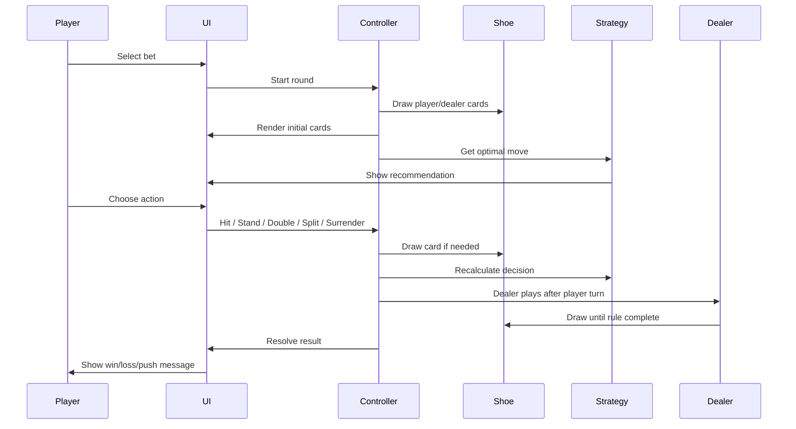

# The 21st Jack — Full Workflow Description

This document explains the complete workflow of **The 21st Jack**, from project setup to gameplay, internal architecture, and deployment.

---

## 1. Development Workflow

### Step 1: Open Project in VS Code

The developer opens the project folder in VS Code.

```bash
cd ~/Downloads/blackjack-pro-phaser
code .
```

### Step 2: Install Dependencies

```bash
npm install
```

This installs Phaser, Vite, TypeScript, Vitest, and supporting packages.

### Step 3: Run Local Server

```bash
npm run dev
```

Vite starts a local development server, usually at:

```text
http://localhost:5173
```

### Step 4: Edit Code

The developer edits files inside `src/`. Vite automatically reloads the browser when changes are saved.

### Step 5: Test

```bash
npm test
```

Unit tests verify hand scoring, soft Ace handling, basic strategy, and shoe behavior.

### Step 6: Build for Production

```bash
npm run build
```

The final optimized web app is generated inside `dist/`.

---

## 2. Player Gameplay Workflow



---

## 3. Game State Workflow

The game uses a central state controller.

Main phases:

| Phase | Meaning |
|---|---|
| `idle` | Game loaded, waiting for first bet |
| `betting` | Player selects bet |
| `dealing` | Cards are being dealt |
| `insurance` | Dealer shows Ace and insurance is offered |
| `playerTurn` | Player chooses hit/stand/double/split/surrender |
| `dealerTurn` | Dealer reveals hole card and plays |
| `roundOver` | Results are calculated and shown |

---

## 4. Blackjack Round Workflow

### Betting

The player chooses a chip amount. The selected bet is checked against the current bankroll.

### Dealing

The game deals two cards to the player and two cards to the dealer. The dealer’s second card is hidden.

### Natural Blackjack Check

If the player has Ace + 10-value card, the game checks whether the dealer also has Blackjack.

Outcomes:

- Player Blackjack only = 3:2 payout
- Dealer Blackjack only = player loses
- Both Blackjack = push

### Player Actions

The player acts on each active hand. If the player splits, the game creates multiple active hands and resolves them one by one.

### Dealer Actions

Dealer follows H17 rules:

- Hit under 17
- Hit soft 17
- Stand on hard 17+

### Resolution

Every player hand is compared against the dealer hand. The bankroll and session stats are updated.

---

## 5. Strategy Workflow

The strategy engine receives:

- Player cards
- Dealer up-card
- True count
- Allowed actions
- Current rule configuration

It determines whether the hand is:

- Hard total
- Soft total
- Pair

Then it checks the correct table and returns one of:

| Code | Action |
|---|---|
| `H` | Hit |
| `S` | Stand |
| `D` | Double |
| `P` | Split |
| `R` | Surrender |

If count deviations apply, the strategy may override basic strategy.

---

## 6. Probability Workflow

The probability system estimates outcome chance based on:

- Player total
- Dealer up-card
- Remaining cards in the shoe
- Dealer drawing rules

The current implementation is simulation-friendly and can be improved later with exact recursive EV calculation.

---

## 7. UI Workflow

### Phaser Layer

Phaser handles:

- Table background
- Cards
- Dealer hand
- Player hands
- Card placement
- Basic animations

### HTML/CSS HUD Layer

The HUD handles:

- Bankroll
- Bet buttons
- Hit/stand/double/split/surrender buttons
- Strategy panel
- Shoe stats
- Session stats
- Toast messages

This split keeps the game visually rich while keeping UI easy to update and mobile-friendly.

---

## 8. Mobile Workflow

For mobile, the layout changes:

- Table scales to fit viewport
- Cards become smaller
- Controls become touch-friendly
- Side panel moves below or becomes stacked
- Buttons remain visible while playing

To test on phone:

```bash
npm run dev -- --host 0.0.0.0
ipconfig getifaddr en0
```

Then open the Mac’s local IP on the phone:

```text
http://YOUR_MAC_IP:5173
```

Both devices must be on the same Wi-Fi network.

---

## 9. GitHub Workflow

### First Push

```bash
git init
git add .
git commit -m "Initial release of The 21st Jack"
git branch -M main
git remote add origin https://github.com/Parthpee/The-21st-Jack.git
git push -u origin main
```

### Normal Update Push

```bash
git add .
git commit -m "Describe the update"
git push
```

---

## 10. Deployment Workflow

### Build

```bash
npm run build
```

### Deploy

Upload the `dist/` folder to one of these:

- GitHub Pages
- Netlify
- Vercel
- Cloudflare Pages

---

## 11. Future Development Workflow

Recommended next development phases:

1. Add casino sound effects
2. Add advanced card animations
3. Add mobile PWA install support
4. Add settings panel for custom rules
5. Add exact EV calculator
6. Add player mistake detection
7. Add tutorial mode
8. Add leaderboard
9. Add multiplayer simulation
10. Add deployment pipeline
